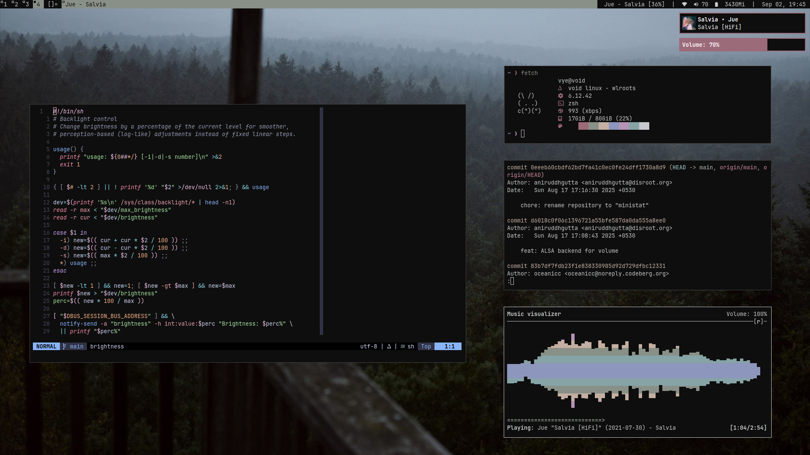
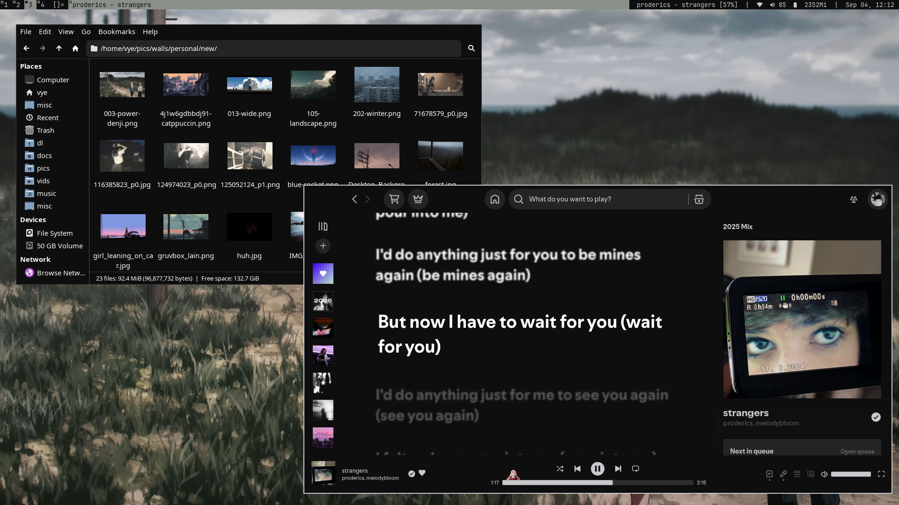

# dots

my minimal dotfiles





### Configs
- **Status**: [ministat](https://codeberg.org/oceanicc/ministat)
- **Neovim**: [comfynvim](https://codeberg.org/oceanicc/comfynvim)
- **dwl (patched)**: [dwl](https://codeberg.org/oceanicc/dwl)

### Programs
- **Init**: runit, dinit (turnstile)
- **Monitor layouts**: kanshi
- **Notification daemon**: mako
- **Terminal**: foot
- **Launcher**: mew
- **Screenlock**: [wlock](https://codeberg.org/sewn/wlock) with [widle](https://codeberg.org/sewn/widle)
- **Shell**: zsh, bash
- **Editor**: neovim, helix
- **Fetch**: [cutefetch](./.local/bin/cutefetch)
- **Music player**: spotify-player, ncmpcpp (mpd), spotify (spicetify)
- **File manager**: lf, thunar
- **PDF**: zathura
- **Browser**: chromium, librewolf
- **Wallpapers**: wbg
- **Colorscheme manager**: pywal

### Menus (custom scripts)
- **Clipboard**: cliphist (wl-clip-persist)
- **Color picker**: [colorpick](./.local/bin/colorpick)
- **Emoji menu**: [emojimenu](./.local/bin/emoji-menu)
- **Wallpaper menu**: [theme](./.local/bin/theme)
- **Screenshots**: [screenshot](./.local/bin/screenshot)

### Extras (custom)
- **GTK theme**: [minidark](./extras/minidark/)
- **spicetify theme**: [walspot](./.config/wal/templates/colors-spicetify.ini)
- **zen browser extensions**: [zen export](./extras/zen-themes-export.json)
- **yt enhancer config**: [enhancer](./extras/enhancer)
- **equaliser preset**: [custom eq](./extras/spotify/final-eq.json)
- **spicetify config**: [spicetify config](./extras/spotify/spicetify)


## Installation

> [!IMPORTANT]
> while these configs can be used on any system, please do modify them according to your distro and needs beforehand to avoid any issues
> for example, dinit services and dbus are not required for the vast majority of systems with systemd, and some packages like nvidia drivers (and programs i use personally) do not need to be installed

to use the install script, simply run -
```shell
git clone https://codeberg.org/oceanicc/minidots ~/minidots     # clone the repo
cd ~/minidots                   # enter the repo
chmod +x ./extras/install.sh    # make the install script executable
chmod +x ./extras/post-install.sh    # make the post-install script executable
chmod +x ./extras/pkg-list.sh   # make the package install script executable
./extras/install.sh             # run the install script
```


## Install script details

the install script is written in a very simple and easy to understand manner. please do modify it to suite your needs and remove any unessescary actions. i've listed what the install script does below:

### System configs
- rewrites doas conf
- enables autologin from tty for dinit
- modifies sudo conf to allow members of wheel group to run sudo commands without password (convenient for startw)
- modifies grub conf (timeout and menu)
- modifies makeflags (-j8, change according to your systems threads, or if unsure, comment it out to avoid any changes)

### Mirrors (artix)
- adds arch repos to artix

### Yay (arch/artix)
- installs yay-bin if not installed (aur manager)

### Packages
- installs packages from [package list](./extras/pkg-list.sh) (please refer to the [package list](./extras/pkg-list.sh) and remove any unessential packages that you don't want)
- *Note - the package list is not updated for void linux, issues may occur*

### Services (systemd/dinit)
- enables necessary services and copies user services (for dinit)
- dinit user services are used (with turnstile) to handle autostart of mpd, pipewire (with wireplumber) and syncthing, do disable them if you're not using them with ```dinitctl -u disable <service_name>```

### GTK theme
- installs custom gtk theme [minidark](./extras/minidark/)
- changes index.theme to inherit installed cursor theme (bibata)

### Stow dotfiles
- makes necessary directories
- stows (links) dotfiles in respective directories

### Graphics information (important)
- sets nouveau as default graphics driver to be used (might cause issues if not done, can switch to other graphics post-installation)

### Wallpaper information
- sets wallpaper to the one provided in repo - [wallpaper](./extras/wall.png)

### Clone and compile programs
- clones and compiles all the programs i use

### Final
- changes shell to zsh
- runs grub-mkconfig (if using grub)

### ARCHIVED (disabled) - compile wlroots and dulcepan
- compiles wlroots in the proper directory
- compiles dulcepan (alternative screenshot manager for wayland)


## Post install script details

- for dinit user services and automatic gtk theme application, please run the [post-install](./extras/post-install.sh) script after a reboot and starting dwl*
- enables dinit user services
- sets gtk theme, changes icon pack and changes cursor theme and size
- dwl has to be recompiled after selecting any cursor theme/size (but works out of the box by install script)
- recompiles dwl to use cursor theme


## Spotify script details

- [spotify](./extras/spotify/spotify.sh) - optional post-install commands to install spotify with spicetify and custom theme (arch/artix)
- *Note - custom [spicetify settings](./extras/spotify/spicetify) should be manually imported*
